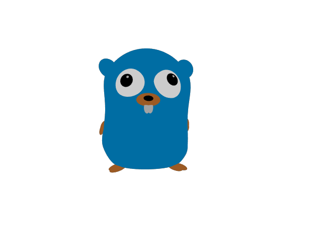

# 3D Model

 
The Go gopher was designed by Renee French. (http://reneefrench.blogspot.com/)
The gopher 3D model was made by Takuya Ueda (https://twitter.com/tenntenn).
Licensed under the Creative Commons 3.0 Attributions license.
 
